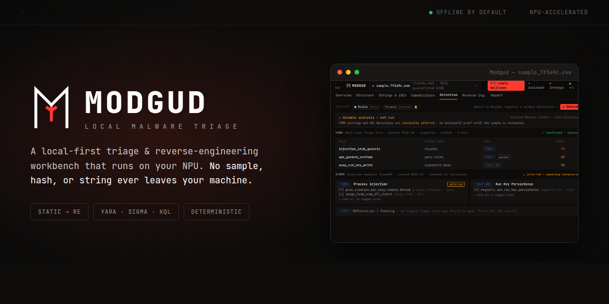

# Modgud

A local-first malware triage and reverse-engineering workbench. Your samples never leave your machine, and the AI runs on your own hardware rather than a cloud service.

> Móðguðr guards the bridge into the realm of the dead and lets no soul cross without stating its name and its business. Modgud does the same to every binary you hand it.

## Why it exists

SOC and DFIR analysts triage a lot of suspicious files, and cloud AI assistants are off the table for the job that would benefit most. You can't upload a possible malware sample, a customer artifact, or an internal hash to a third-party API. So the analysis that could be sped up by an assistant is exactly the analysis that has to stay offline.

Modgud runs the whole triage loop on one machine: static analysis, community detection rules, reverse engineering, and an AI assistant that explains what it finds. The AI runs locally on your own hardware, using the NPU where it's supported and the GPU or CPU otherwise. Nothing is sent anywhere. The tool works with the network cable unplugged.

## What it does

- **Expert static triage.** Parses PE, ELF, and Mach-O; maps sections and entropy; extracts and categorizes strings (ASCII and UTF-16); surfaces network indicators corroborated by import capabilities; tags MITRE ATT&CK techniques.
- **Community rules, first pass.** Scans with YARA Forge out of the box. Maps inferred behaviors to the Sigma rules that would catch them at runtime, and shows where coverage is missing.
- **Reverse engineering built in.** Bundles Rizin and the rz-ghidra decompiler. Browse functions, read pseudo-C, jump from a suspicious string to the code that uses it. No separate install.
- **A local analyst, not a cloud one.** An on-device LLM summarizes findings, explains a function, and drafts detection rules, grounded only in what the deterministic analysis found. It runs on whatever accelerator you have: the NPU on supported AMD Ryzen AI, otherwise the GPU, otherwise the CPU.
- **Private and air-gap capable.** Network clients are loopback-only. There is no telemetry, no cloud model, and no code path that reaches a remote service. You pick a local model on first run (a one-time download); after that the tool works with the network cable unplugged. That behavior is structural rather than a setting, so you can verify it instead of trusting this README.

## Status

Modgud is in active development as a solo project. The current release covers static triage, rule scanning, and reverse engineering. Dynamic analysis (via CAPE) and a local KQL detection-authoring module are on the roadmap.

Issues and feature requests are welcome through GitHub Issues. This is a one-person project, so they're reviewed periodically rather than in real time.

## Platform support

**Ubuntu is the primary target.** Modgud is developed and tested on **Ubuntu 26.04 LTS running on a Framework Laptop 13 with AMD Ryzen AI**. That is the one configuration exercised on real hardware, and where the NPU acceleration path is validated, so builds for it come first.

The tool isn't locked to it. The AI runtime is bundled and picks the right backend for your hardware: the NPU where it's supported, the GPU otherwise, and the CPU as a last resort. For LLMs specifically, only AMD Ryzen AI (via Lemonade/FastFlowLM) genuinely uses the NPU today; everywhere else the model runs on the GPU, which is still fully local and private.

| Hardware | OS | LLM runs on | Notes |
|---|---|---|---|
| **AMD Ryzen AI 300/400 (XDNA 2)** | Linux (Ubuntu) | **NPU** + GPU | Primary target; NPU-accelerated, tested |
| AMD Ryzen AI (XDNA 2) | Windows | **NPU** + GPU | NPU-accelerated |
| AMD Ryzen AI (XDNA 1) / Radeon | Linux / Windows | GPU / CPU | Runs, no NPU LLM path |
| Intel Core Ultra | Linux / Windows | GPU (iGPU) | Runs via GPU; NPU LLM path not used |
| Apple Silicon (M1–M5) | macOS | GPU (Metal) | Runs; less tested |
| Qualcomm Snapdragon X | Windows | GPU / CPU | Runs; NPU LLM path immature |
| Any x86-64, no accelerator | Linux / Windows | CPU | Last resort; slow but works |

Non-Ubuntu targets are less tested for now; wider testing and per-platform builds will follow.

## Handling samples responsibly

Today, Modgud is static-only: the current release inspects files at rest and does not execute them.

Dynamic analysis is on the roadmap, but the design keeps a firm boundary. Even then, Modgud will not be the thing that runs a sample. It acts as a client to a separate, user-operated sandbox (CAPE) that you stand up and control: Modgud submits the sample and reads back the results, while the isolated sandbox performs and contains any execution. Modgud never implements detonation itself.

Malware samples are dangerous files regardless of how you inspect them. Handle them with the usual care: keep them contained, follow your organization's procedures for storing and transferring them, and use a purpose-built, isolated environment for anything involving execution. Modgud tells you about a file; the safeguards around the file are yours.

## Built on

Modgud stands on the work of others:

- [Lemonade](https://lemonade-server.ai/) (bundled) as the local AI runtime, with [FastFlowLM](https://github.com/FastFlowLM/FastFlowLM) for NPU inference on AMD Ryzen AI
- [Rizin](https://rizin.re/) and rz-ghidra for disassembly and decompilation
- [YARA Forge](https://yarahq.github.io/) and [SigmaHQ](https://sigmahq.io/) for detection rules
- [CAPE](https://github.com/kevoreilly/CAPEv2) for the planned dynamic analysis module

## Staying updated

Follow along on LinkedIn for releases and write-ups on how the harder parts work.

## License

Modgud's core is proprietary; the released binary is covered by its EULA. The SDK, schemas, documentation, and community rule repositories are open under permissive licenses. See each repository for details.
